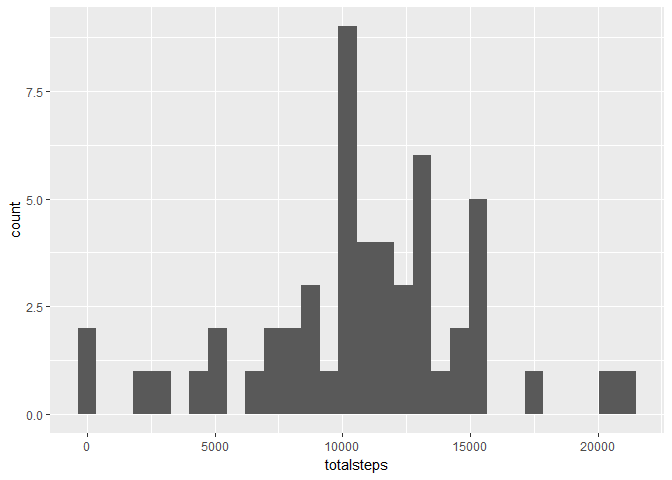
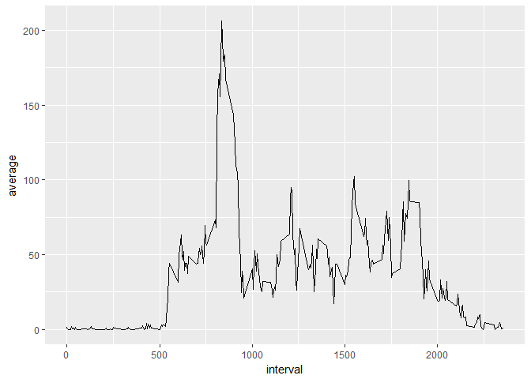
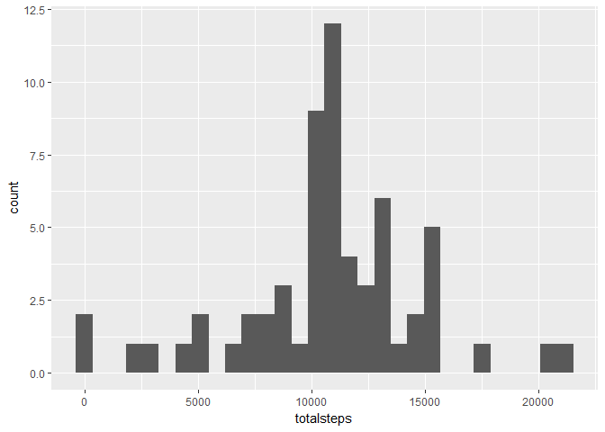
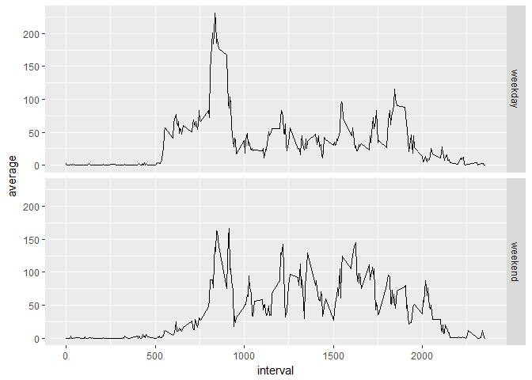

# Reproducible Research: Peer Assessment 1


## Loading and preprocessing the data

```r
unzip("activity.zip")
activity<-read.csv("activity.csv")
activity$date<-as.Date(as.character(activity$date))
```
## What is mean total number of steps taken per day?

```r
library(dplyr)
```

```
## 
## Attaching package: 'dplyr'
```

```
## The following objects are masked from 'package:stats':
## 
##     filter, lag
```

```
## The following objects are masked from 'package:base':
## 
##     intersect, setdiff, setequal, union
```

```r
library(ggplot2)
```
### calculate the total number of steps taken per day

```r
activity<-group_by(activity, date)
totalsteps<-summarise(activity, sum(steps))
```
### make a histogram of the total number of steps taken each day

```r
names(totalsteps)[2]<-'totalsteps'
ggplot(data = totalsteps, mapping = aes(x=totalsteps))+
    geom_histogram()
```

```
## `stat_bin()` using `bins = 30`. Pick better value with `binwidth`.
```

```
## Warning: Removed 8 rows containing non-finite values (stat_bin).
```

<!-- -->

### calculate the mean and median of the total number of steps taken per day

```r
mean(totalsteps$totalsteps, na.rm = TRUE)
```

```
## [1] 10766.19
```

```r
median(totalsteps$totalsteps, na.rm = TRUE)
```

```
## [1] 10765
```

## What is the average daily activity pattern?
### calculate average number of steps taken daily

```r
activity<-group_by(activity, interval)
averagesteps<-summarise(activity, mean(steps, na.rm = TRUE))
```
### make a time series plot of the 5-minute interval and the average number of steps taken, averaged across all days

```r
names(averagesteps)[2]<-'average'
ggplot(data = averagesteps, mapping = aes(x=interval, y=average))+
    geom_line()
```

<!-- -->

### Which 5-minute interval, on average across all the days in the dataset, contains the maximum number of steps?

```r
averagesteps[which.max(averagesteps$average),][1]
```

```
## # A tibble: 1 x 1
##   interval
##      <int>
## 1      835
```
So interval 835 contains the maximum number of steps.

## Imputing missing values
### calculate and report the total number of missing values in the dataset

```r
sum(is.na(activity$steps))
```

```
## [1] 2304
```
### Create a new dataset that is equal to the original dataset but with the missing data filled in
My strategy is to fill in missing values with mean for 5-minute interval which is already calculated above. Because the mean value is the best to reflect typical activities for a given period.

```r
activity_new<-activity
activity_new$steps<-ifelse(is.na(activity_new$steps), averagesteps$average, activity_new$steps)
```
### make a histogram of the total number of steps taken each day

```r
activity_new<-group_by(activity_new, date)
totalsteps_new<-summarise(activity_new, sum(steps))
names(totalsteps_new)[2]<-'totalsteps'
ggplot(data = totalsteps_new, mapping = aes(x=totalsteps))+
    geom_histogram()
```

```
## `stat_bin()` using `bins = 30`. Pick better value with `binwidth`.
```

<!-- -->

### Calculate and report the mean and median total number of steps taken per day

```r
mean(totalsteps_new$totalsteps)
```

```
## [1] 10766.19
```

```r
median(totalsteps_new$totalsteps)
```

```
## [1] 10766.19
```
So the mean values are the same. The median value is slightly bigger than that from the fisrt part.
Imputing missing data does not have much impact on the estimates.

## Are there differences in activity patterns between weekdays and weekends?
### create a new factor variable in the dataset with two levels -- "weekday" and "weekend" indicating whether a given date is a weekday or weekend day

```r
weekend<-c('Saturday','Sunday')
activity_new$weekday<-ifelse(weekdays(activity_new$date) %in% weekend, 'weekend', 'weekday')
```
### make a panel plot containing a time series plot of the 5-minute interval and the average number of steps taken, averaged across all weekday days or weekend days

```r
activity_new<-group_by(activity_new, weekday, interval)
averagesteps_new<-summarise(activity_new, mean(steps))
names(averagesteps_new)[3]<-'average'
ggplot(data = averagesteps_new, mapping = aes(x=interval, y=average))+
    geom_line()+
    facet_grid(weekday~.)
```

<!-- -->
